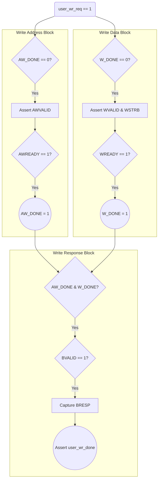
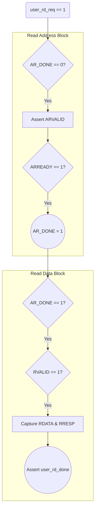

# Universal AXI4-Lite Master Architecture

To build a professional, fully compliant AXI4-Lite Master, we must design it so that the 5 AXI channels operate **completely independently**. This prevents the bus from freezing (deadlocking) if a slave behaves in an unusual order.

---

## 1. Was our Slave completely independent?
You asked a great question: *Did the AXI-Lite Slave we wrote earlier use independent channels?*

**Answer:** Our Slave was **Semi-Independent**.
1. **Write vs. Read:** YES, they are 100% independent. We built a `Write FSM` and a `Read FSM` in completely separate `always` blocks. The slave can process a Read and a Write at the exact same time.
2. **AW (Address) vs. W (Data):** NO, they were sequence-dependent. If you look at our `W_IDLE` state in the slave, it waits for `AWVALID` (the address) to arrive first. If the Master sends the Data (`WVALID`) *before* the Address (`AWVALID`), our Slave ignores the data until the address arrives. 
   - *Is this legal?* Yes! The AXI spec specifically allows a Slave to wait for the address before accepting data. However, for a **Master**, the spec strictly forbids waiting for the slave's `READY` signal before asserting `VALID`. A Master must be fully independent.

---

## 2. The Universal Master Concept
Instead of a giant State Machine with 10 different states, a Universal Master uses **Independent Control Blocks** for each channel. They communicate using internal "done" flags.

### User Control Interface (The CPU/DMA side)
The user side doesn't know anything about AXI. It just sets requests and waits for done signals.
* `user_wr_req`: "I want to write!"
* `user_wr_addr`, `user_wr_data`: Where and what to write.
* `user_wr_done`: "The write is finished!"
* `user_wr_resp`: Did it succeed (OKAY) or fail (SLVERR)?

---

## 3. Flow Map: Write Transaction (AW, W, B)

### Explanation of the Write Flow:
1. **Simultaneous Launch:** When `user_wr_req` goes high, **both** the AW Block and W Block wake up. They both instantly assert `AWVALID` and `WVALID`.
2. **Independent Acceptance:** 
   - If the slave accepts the Address first, `AW_DONE` becomes 1. The W block keeps trying to send data.
   - If the slave accepts the Data first, `W_DONE` becomes 1. The AW block keeps trying to send the address.
3. **The Response Gathering:** The B block patiently waits until **both** `AW_DONE` and `W_DONE` are exactly 1. Once both are 1, it asserts `BREADY` and waits for the slave's `BRESP`. 
4. **Completion:** Once `BVALID` is received, it pulses `user_wr_done` to tell your custom logic that the job is done, and it clears all the flags back to 0.

---

## 4. Flow Map: Read Transaction (AR, R)

The Read channels are even simpler because there are only two of them: Address (AR) and Data Response (R).

### Explanation of the Read Flow:
1. **Launch Address:** When `user_rd_req` goes high, the AR block asserts `ARVALID`.
2. **Wait for Address Acceptance:** Once the slave asserts `ARREADY`, `AR_DONE` becomes 1.
3. **Receive Data:** The R block sees that `AR_DONE` is 1, so it asserts `RREADY`. It waits until the slave asserts `RVALID`.
4. **Completion:** It grabs the `RDATA` (the actual memory value) and `RRESP` (OKAY/SLVERR), then pulses `user_rd_done`.
